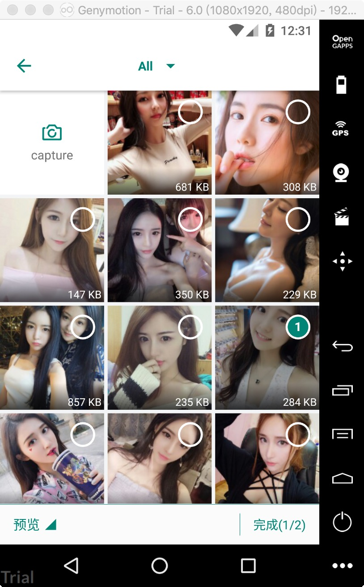

# Wisdom 多图片选择库 

### 项目介绍

Android 图片选择器，图片\视频选择，支持UI界面完全自定义，一款更加灵活的多媒体选择工具。

### wisdom_lib 核心
- 支持图片，视频查询
- 支持多数量选择 
- 支持打开拍照，录像
- 支持自定义图片加载
- 支持自定义图片压缩
- 支持自定义图片裁剪
- 支持文件过滤，加载指定格式图片
- 适配AndroidQ
- 充分自由定制

### wisdom_impl UI层
- 默认的UI风格
- 实现wisdom_lib所有功能
- 可以基于UI层进行修改

### 依赖
```groovy

allprojects {
  repositories {
    mavenCentral()
  }
}

dependencies {
    //核心库版本
    implementation 'io.github.zguop:wisdom_lib:1.0.19'
    //UI版本
    implementation 'io.github.zguop:wisdom_impl:1.0.19'
}
```
### 使用
只配置需要的api即可
```groovy

Wisdom.of(this@MainActivity)
        .config(ofType) //选择类型 ofAll() ofImage() ofVideo()
        .imageEngine(imageEngine) //图片加载引擎
        .compressEngine(compressEngine)
        .cropEngine(cropEngine)
        .selectLimit(selectLimit) //选择的最大数量 数量1为单选模式
        .fileProvider("$packageName.utilcode.provider", "image") //兼容android7.0
        .isCamera(isCamera) //是否打开相机，
        .setMedias(resultMedia)
        .filterImageMaxFileSize(imageFilterMaxFile)
        .filterVideoMaxFileSize(videoFilterMaxFile)
        .mimeTypeSet(mimeTypeSet, false)
        .forResult(
            0x11,
            PhotoWallActivity::class.java
        ) //requestCode，界面实现Activity，需要继承于核心库WisdomWallActivity
     
override fun onActivityResult(requestCode: Int, resultCode: Int, data: Intent?) {
    super.onActivityResult(requestCode, resultCode, data)
    if (Activity.RESULT_OK == resultCode) {
        if (requestCode == 0x11 && data != null) {
            val resultMedia = Wisdom.obtainResult(data) //获取回调数据 类型Media 包含String path， Uri uri 路径
            Log.e("aa", resultMedia.toString())
            resultMedia.forEach { media ->
                        Log.e("aa", " 原图地址 " + media.path)
                        Log.e("aa", " 压缩图片地址 " + media.compressNullToPath())
                        Log.e("aa", " 裁剪图片地址 " + media.cropNullToPath())
                        Log.e("aa", " 压缩图片 -> 裁剪图片 -> 原图 " + media.compressOrCropNullToPath())
                    }
        }
    }
}

//直接进入预览页面 预览图片

Wisdom.of(this@MainActivity)
     .preview()
     .imageEngine(imageEngine)
     .setMedias(List<Media>)
     .go(PhotoPreviewActivity::class.java)

```

### 配置engine
框架提供扩展接口，实现各自自定义功能。可参考Demo中相应engine实现、可以拷贝使用

>* ImageEngine    实现图片加载 -> GlideEngine 、PicassoEngine
>* CompressEngine 实现图片压缩 -> TinyCompressEngine
>* CropEngine     实现图片裁剪 -> CropperEngine 、UCropEngine

### 项目截图

|图|图|
|---|---|
|||


### 更新

    时间：20210622（1.0.19）
    内容：1.适配AndroidX；
         2.适配AndroidQ；
         3.增强文件筛选功能：最大图片限制，最大视频限制，文件类型筛选
         4.整体优化

    时间：20200705（1.0.16）
    内容：新增图片裁剪接口，扩展图片裁剪功能，自定义实现CropEngine，demo集成UCrop和Cropper裁剪框架，具体在Demo中查看。
         增加文件选择限制，超过 filterMaxFileSize 进行文件大小过滤。

    时间：20200509（1.0.15）
    内容：新增图片压缩接口，扩展图片压缩功能，demo集成tiny压缩框架，具体查看TinyCompressEngine类，后面更新luban压缩，其它代码优化
    
    时间：20200507（1.0.13）
    内容：增加string-pt,string-fr 语言描述~~~

    时间：20191129（1.0.12）
    内容：增加string-en 支持2中语言描述了~~~
    
    时间：20191126（1.0.11）
    内容：修改切换相册的弹框，不在使用popWindow实现，兼容太难啦 自己写了个view- -

    时间：20191112（1.0.10）
    内容：细节小修改，无任何影响

    时间：20191102（1.0.9）
    内容：默认勾选图片。扩展图片预览功能，可以直接进入图片预览界面浏览
    
    时间：20190627（1.0.8）
    内容：增强体验，在权限请求拒绝时，pop不可以再弹出

    时间：20190626（1.0.7）
    内容：修复了一个bug，进入预览页，由于相机的是否打开，疏忽了position的值，导致position值正确
    
    时间：20190624（1.0.6）
    内容：稳定相机兼容性

    时间：20190621（1.0.5）
    内容：低版本兼容api兼容，wisdom_impl导入发生资源冲突，则使用exclude group :'com.android.support' 移除support

    时间：20190617（1.0.4）
    内容：增加两种图片裁剪实例，sdk本身暂不提供裁剪接口，查看demo获取实现裁剪方式
    
    时间：20190613（1.0.3）
    内容：imageEngine增加到三个方法，分别加载(相册封面,缩略图，预览图) picasso加载适配

    时间：20190612（1.0.2）
    内容：一些功能优化，去除Media图片文件名字段，其实可以通过路径Path获取
    
    时间：20190611（1.0.0）
    内容：图片选择框架发布，支持图片or视频单选，多选，打开相机，图片预览

总结
-
xiexie ni de guāng gù ！ 喜欢的朋友轻轻右上角赏个star，您的鼓励会给我持续更新的动力。


